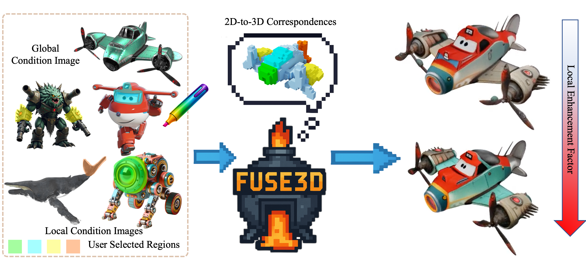

  <h2 align="center">Fuse3D: Generating 3D Assets Controlled by Multi-Image Fusion</h2>
  

    <strong>Xuancheng Jin</strong>
    ·
    <strong>Rengan Xie</strong>
    ·
    <strong>Wenting Zheng</strong>
    ·
    <a href="https://kkbless.github.io/"><strong>Rui Wang</strong></a>
    ·
    <a href="https://rfidblog.org.uk/"><strong>Hujun Bao</strong></a>
    ·
    <a href="http://www.cad.zju.edu.cn/home/huo/"><strong>Yuchi Huo</strong></a>
     
     
        
     
  

  
  <table align="center">
    <tr>
    <td>
      
    </td>
    </tr>
  </table>

## 📢 News
* **[Sept.15.2025]** Fuse3D is accepted to SIGGRAPH Asia 2025. The code is still being organized. Stay tuned for updates!
